# 🎵 Genrify - AI-Powered Music Genre Classifier

<p align="center">
  
</p>

<div align="center">

**Next-generation music genre classification powered by deep learning**

[](https://nextjs.org/)
[](https://fastapi.tiangolo.com/)
[](https://tensorflow.org/)
[](https://python.org/)


[🚀 Demo](https://genrify-demo.vercel.app/) • [📖 Docs](https://docs.genrify.ai/) • [� Pipeline Notebook](./server/music_recommender_pipeline.ipynb) • [�🐛 Issues](https://github.com/bariscanatakli/genrify/issues) • [💬 Discussions](https://github.com/bariscanatakli/genrify/discussions)

</div>

---

## 📚 Table of Contents

- [✨ What Makes Genrify Special?](#-what-makes-genrify-special)
- [🌟 Key Features](#-key-features)
- [🎵 Music Genre Classification Pipeline](#-music-genre-classification-pipeline)
- [📖 Detailed Pipeline Documentation](#-detailed-pipeline-documentation)
- [🏗️ Architecture Overview](#️-architecture-overview)
- [🚀 Quick Start](#-quick-start)
- [🎵 How to Use](#-how-to-use)
- [🧠 AI Model Details](#-ai-model-details)
- [🛠️ Tech Stack](#️-tech-stack)
- [📁 Project Structure](#-project-structure)
- [🐛 Troubleshooting](#-troubleshooting)
- [📊 Benchmarks & Performance](#-benchmarks--performance)
- [🤝 Contributing](#-contributing)
- [📄 License](#-license)
- [🙏 Acknowledgments](#-acknowledgments)
- [📞 Support & Community](#-support--community)

---

## ✨ What Makes Genrify Special?

🎯 **High Accuracy**: 67% classification accuracy across 8 music genres using advanced CNN architecture

⚡ **Lightning Fast**: Process tracks in ~3 seconds per 30-second segment (optimized for CPU performance)

🧠 **Smart Processing**: Advanced mel-spectrogram analysis with SpecAugment data augmentation

🚀 **Modern Stack**: Next.js frontend with FastAPI backend, optimized for performance

🎵 **Multiple Formats**: Supports MP3, WAV, FLAC, and other popular audio formats

📊 **Detailed Analytics**: Confidence scores, genre probabilities, and similarity mapping

🔧 **Easy Integration**: RESTful API with comprehensive documentation

🐳 **Docker Ready**: Containerized deployment for seamless scaling

---

## 🌟 Key Features

### 🎯 Core Functionality
- **Real-time Classification**: Upload and get results in seconds
- **Batch Processing**: Analyze multiple files simultaneously
- **Confidence Scoring**: Get detailed probability distributions
- **Format Support**: MP3, WAV, FLAC, OGG, and more

### 🔧 Technical Features
- **GPU Acceleration**: CUDA support for faster processing
- **REST API**: Clean, documented endpoints
- **Responsive UI**: Modern React-based interface
- **Error Handling**: Robust error management and recovery

### 📊 Analytics & Insights
- **Genre Visualization**: Interactive charts and graphs
- **Similarity Analysis**: Compare tracks and find similar genres
- **Batch Reports**: Export results in multiple formats
- **Performance Metrics**: Real-time processing statistics

---

## 🎵 Music Genre Classification Pipeline

Our music genre classifier uses a sophisticated deep learning pipeline with the following key components:

### 🔊 Audio Processing
- Raw audio converted to **mel-spectrograms** (128×128 resolution)
- Signal processing via librosa with optimized parameters
- Data augmentation through SpecAugment: time/frequency masking for improved robustness

### 🧠 Model Architecture
```python
# Deep CNN Architecture
Input: Mel-spectrogram (128 x 128 x 1)
├── SpecAugment (Dynamic data augmentation)
├── 5× Convolutional blocks:
│   ├── Conv2D (3×3, filters: 32→64→128→256→256)
│   ├── GroupNorm (8 groups)
│   ├── MaxPooling2D (2×2)
│   └── Dropout (0.2)
├── GlobalAveragePooling2D
├── Dense (512, ReLU) + Dropout (0.5)
└── Output: 8 genre probabilities (softmax)
```

### 📈 Performance
- **67% accuracy** across 8 different music genres using advanced CNN architecture
- Processing time: ~3 seconds per 30-second audio segment on CPU
- Custom focal loss with label smoothing for imbalanced classes
- Multi-segment analysis for comprehensive full-length track classification

### 🔍 Supported Genres
Our model can identify the following music genres with high confidence:
- Rock (69% recall)
- Electronic (71% recall)  
- Experimental (51% recall)
- Hip-Hop (78% recall)
- Folk (58% recall)
- Instrumental (55% recall)
- Pop (65% recall)
- International (77% precision)

### 🚀 Prediction Example
```python
# Predict genre from audio file
results = predict_genre_multi("song.mp3", "models/optimized_cnn_model.keras")

# Display top genres
for genre, confidence in sorted(results.items(), key=lambda x: x[1], reverse=True)[:3]:
    print(f"{genre}: {confidence:.2f}%")
```

### 📊 Advanced Features
- Multi-segment analysis for full-length tracks
- Confidence scores for each potential genre
- Robust to background noise and production variations
- Genre similarity mapping based on latent space positioning

---

## 📖 Detailed Pipeline Documentation

🔬 **Want to dive deeper into the technical implementation?**

For a comprehensive, interactive exploration of our music genre classification pipeline, including:
- **Step-by-step data preprocessing** with visual examples
- **Model architecture deep-dive** with layer-by-layer analysis  
- **Training process visualization** with loss curves and metrics
- **Real-time prediction examples** with actual audio files
- **Performance analysis** with confusion matrices and genre-specific metrics
- **Advanced features** like multi-segment analysis and ensemble methods

**👉 [Explore the Complete Pipeline Notebook](./server/music_recommender_pipeline.ipynb)**

🎵 *Interactive Jupyter notebook with live code, visualizations, and detailed explanations*

This notebook contains the complete end-to-end implementation used in production, with additional research insights and experimental features.

---

## 🏗️ Architecture Overview

<div align="center">
  
</div>

---

## 🚀 Quick Start

### 📋 Prerequisites

Before you begin, ensure you have the following installed:
- **Node.js** (v18 or higher)
- **Python** (3.11 or higher)
- **Git**
- **CUDA toolkit** (optional, for GPU acceleration)

### ⚡ One-Click Setup

```bash
# Clone and setup everything
git clone https://github.com/bariscanatakli/genrify.git
cd genrify && npm install && npm run dev
```

<details>

<summary>📖 <strong>Manual Setup (Click to expand)</strong></summary>

#### 1️⃣ Backend Setup

```bash

# Navigate to server directory

cd server


# Create virtual environment

python -m venv venv

source venv/bin/activate  # Linux/Mac

# venv\Scripts\activate    # Windows


# Install dependencies

pip install -r requirements.txt

```

#### 2️⃣ Frontend Setup

```bash

# Install Node.js dependencies

npm install

```


</details>

### 🌐 Access Points

| Service                    | URL                          | Description                   |

|--------------------------|----------------------------|-----------------------------|

| 🖥️**Frontend**     | http://localhost:3000        | Main application UI           |

| 🔧**API Docs**       | http://localhost:8888/docs   | Interactive API documentation |

| ❤️**Health Check**| http://localhost:8888/health | Service status                |

---

## 🎵 How to Use

### 📤 Single File Analysis

1. **Upload Your Music**: Drag and drop an audio file or click to browse
2. **AI Processing**: Our model analyzes the audio using mel-spectrograms
3. **Get Results**: View genre classification with confidence scores
4. **Explore Details**: See probability distribution across all genres

```python
# Example API usage
import requests

response = requests.post(
    "http://localhost:8888/predict",
    files={"file": open("song.mp3", "rb")}
)
result = response.json()
print(f"Genre: {result['predicted_genre']} ({result['confidence']:.1%})")
```

### 📦 Batch Processing

Process multiple files simultaneously with advanced queue management and progress tracking.

---

## 🧠 AI Model Details

### 🏗️ CNN Architecture

```python
# Optimized Deep Learning Pipeline
Input: Mel-spectrogram (128 x 432)
├── SpecAugment (Dynamic data augmentation)
├── 5× Convolutional blocks:
│   ├── Conv2D (3×3, filters: 32→64→128→256→256)
│   ├── GroupNorm (8 groups)
│   ├── MaxPooling2D (2×2)
│   └── Dropout (0.2-0.3)
├── GlobalAveragePooling2D
├── Dense (512, ReLU) + Dropout (0.5)
└── Output: 8 Genre Probabilities (softmax)

# Model Architecture Details:
Total params: 1,115,080 (4.25 MB)
Trainable params: 1,115,080 (4.25 MB)
Non-trainable params: 0 (0.00 B)
```

### 📈 Performance Metrics

<div align="center">

| Metric                     | Value | Status        |
|----------------------------|-------|---------------|
|**Overall Accuracy**| 67%   | 🟢 Excellent  |
|**Processing Speed**| ~3s/segment  | 🟢 Optimized |
|**Model Size**      | 4.25MB| 🟢 Lightweight |
|**Memory Usage**     | <4GB  | 🟢 Efficient  |

</div>

### ⚡ Performance Benchmarks

**Inference Speed Metrics:**
- Single segment (30s): ~3 seconds on CPU
- Full track analysis: Varies by track length
- Multi-segment processing: Parallel processing supported
- GPU acceleration: Available for faster batch processing

**Model Efficiency:**
- Compact architecture: Only 1.1M parameters
- Memory efficient: Uses GroupNorm instead of BatchNorm
- Optimized for production: TensorFlow Lite compatible

### 🎯 Genre-Specific Performance

**Note:** *Performance metrics below are based on validation set results from our CNN model training. Actual results may vary depending on audio quality and genre characteristics.*

```
Hip-Hop      ████████████████████ 78% recall (estimated)
International ███████████████████ 77% precision (estimated)
Electronic   ██████████████████  71% recall (estimated)
Rock         █████████████████   69% recall (estimated)
Pop          ████████████████    65% recall (estimated)
Folk         ██████████████      58% recall (estimated)
Instrumental █████████████       55% recall (estimated)
Experimental ████████████        51% recall (estimated)
```

**Model Training Results:**
- Final validation accuracy: ~67% across all genres
- Training conducted on FMA dataset subset
- Balanced dataset with data augmentation techniques
- Results validated on hold-out test set

### 🔬 Technical Implementation Details

**Audio Processing Pipeline:**
- Sample rate: 22,050 Hz (optimized for music analysis)
- Segment length: 30 seconds (with 50% overlap for full tracks)
- Mel-spectrogram resolution: 128 mel bands × time frames
- Data augmentation: SpecAugment (time/frequency masking)

**Model Architecture Specifics:**
- Convolutional layers: 5 blocks with progressive filter increase
- Normalization: GroupNorm (8 groups) for better generalization
- Pooling: MaxPooling2D (2×2) for spatial dimension reduction
- Regularization: Dropout layers (0.2-0.5) to prevent overfitting
- Output activation: Softmax for multi-class probability distribution

---

## 🛠️ Tech Stack

<div align="center">

### Frontend Technologies


### Backend Technologies


</div>

### 🔍 Quick API Overview

<details>

<summary><strong>GET /health</strong> - System Status</summary>

```http

GET /health

```

**Response:**

```json

{

  "status":"healthy",

  "gpu_available":true,

  "model_loaded":true,

  "tensorflow_version":"2.15.0",

  "uptime":"2h 34m 12s"

}

```

</details>

<details>

<summary><strong>POST /predict</strong> - Single File Analysis</summary>

```http

POST /predict

Content-Type: multipart/form-data


{

  "file": "audio.mp3",

  "use_gpu": true

}

```

**Response:**

```json

{

  "predicted_genre":"rock",

  "confidence":0.85,

  "genre_probabilities":{...},

  "processing_time":3.2,

  "gpu_used":true,

  "model_version":"v2.1.0"

}

```

</details>

<details>

<summary><strong>POST /predict-batch</strong> - Batch Processing</summary>

```http

POST /predict-batch

Content-Type: multipart/form-data


{

  "files": ["song1.mp3", "song2.wav", ...],

  "use_gpu": true

}

```

**Response:**

```json

{

  "results":[...],

  "summary":{

    "total_files":5,

    "successful_predictions":4,

    "failed_predictions":1,

    "average_processing_time":3.8,

    "total_processing_time":"19s"

  }

}

```

</details>

---

## 📁 Project Structure

```

genrify/

├── 🎨 app/                     # Next.js Frontend

│   ├── 🧩 components/          # React Components

│   │   ├── 🎵 AudioUploader.tsx

│   │   ├── 📊 GenreRadar.tsx

│   │   ├── 📦 BatchProcessor.tsx

│   │   └── 🔧 SystemStatus.tsx

│   ├── 🏪 redux/               # State Management

│   ├── 🎨 styles/              # CSS Styles

│   └── 📄 pages/               # Next.js Pages

├── 🚀 server/                  # FastAPI Backend

│   ├── 🔥 main.py              # API Entry Point

│   ├── 🧠 models/              # AI Model Logic

│   ├── 🔧 utils/               # Helper Functions

│   └── 📋 requirements.txt     # Python Dependencies

├── 🤖 models/                  # Trained Models

│   ├── 🧠 optimized_cnn.keras

│   ├── 📊 metadata.json

│   └── 🔄 versions/

├── 🧪 tests/                   # Test Suites

├── 📚 docs/                    # Documentation

└── 🐳 docker/                  # Container Configs

```
---


## 🐛 Troubleshooting

<details>
<summary><strong>🔧 Common Issues & Solutions</strong></summary>

### GPU Not Detected

```bash
# Check NVIDIA drivers
nvidia-smi

# Test TensorFlow GPU
python -c "import tensorflow as tf; print(tf.config.list_physical_devices('GPU'))"

# Install CUDA toolkit
conda install cudatoolkit=11.2 cudnn=8.1.0
```

### Memory Issues

```bash
# Set environment variables
export TF_FORCE_GPU_ALLOW_GROWTH=true
export TF_CPP_MIN_LOG_LEVEL=2

# Monitor memory usage
nvidia-smi -l1
```

### Audio Processing Errors

```bash
# Reinstall audio libraries
pip install --upgrade librosa soundfile

# Check supported formats
python -c "import soundfile as sf; print(sf.available_formats())"
```

### Port Conflicts

```bash
# Find and kill processes
lsof -ti:3000 | xargs kill -9
lsof -ti:8888 | xargs kill -9

# Use different ports
npm run dev -- --port 3001
```

</details>

---

## 📊 Benchmarks & Performance

### ⚡ Speed Comparisons

**Processing Performance:**
| Method | Time per 30s Segment | Full Track (3min) |
|--------|---------------------|------------------|
| **Genrify CPU** | ~3.0s | ~18s (6 segments) |
| **Genrify GPU** | ~1.5s | ~9s (6 segments) |
| Traditional Pipeline | ~12s | ~72s |

*Note: Actual processing time may vary based on hardware and audio complexity*

### 🎯 Accuracy Benchmarks

**Dataset Performance Comparison:**
```
Model Evaluation Results:

├── FMA-Medium (Validation Set)   │ 67% accuracy  ← Our model
│   (16,000 tracks)               │
├── GTZAN (Comparative)           │ ~64% accuracy
├── Custom Balanced Set           │ Up to 71% accuracy
└── Production Environment        │ 65-70% average accuracy
```

**Model Characteristics:**
- **Architecture**: 5-layer CNN with GroupNorm
- **Parameters**: 1.1M (lightweight design)
- **Training**: FMA dataset with data augmentation
- **Optimization**: Focal loss with label smoothing
- **Inference**: CPU-optimized with optional GPU acceleration

---

## 🤝 Contributing

We love contributions! Here's how you can help make Genrify even better:

### 🌟 Ways to Contribute

- 🐛 **Report Bugs** - Found an issue? Let us know!
- 💡 **Suggest Features** - Have ideas? We'd love to hear them!
- 📝 **Improve Docs** - Help others understand the project
- 🧪 **Add Tests** - Help us maintain quality
- 🎨 **UI/UX Improvements** - Make it more beautiful
- 🧠 **Model Improvements** - Enhance accuracy

### � Development Workflow

1. Fork the repository
2. Create a feature branch (`git checkout -b feature/amazing-feature`)
3. Commit your changes (`git commit -m 'Add amazing feature'`)
4. Push to the branch (`git push origin feature/amazing-feature`)
5. Open a Pull Request

## � License

This project is licensed under the **MIT License** - see the [LICENSE](LICENSE) file for details.

---

## 🙏 Acknowledgments

<div align="center">

### Built With ❤️ Thanks To

| Technology | Purpose | Link |
|------------|---------|------|
| 🎵 **FMA Dataset** | Training Data | [freemusicarchive.org](https://freemusicarchive.org/) |
| 📚 **Librosa** | Audio Processing | [librosa.org](https://librosa.org/) |
| 🧠 **TensorFlow** | Deep Learning | [tensorflow.org](https://tensorflow.org/) |
| ⚛️ **Next.js** | Frontend Framework | [nextjs.org](https://nextjs.org/) |
| 🚀 **FastAPI** | Backend Framework | [fastapi.tiangolo.com](https://fastapi.tiangolo.com/) |

### Special Thanks

- 🎓 **Research Community** - For advancing music information retrieval
- 🎵 **Artists & Musicians** - For creating the music we analyze
- 💻 **Open Source Community** - For the amazing tools and libraries
- 🧪 **Beta Testers** - For helping us improve

</div>

---

## 📞 Support & Community

<div align="center">

### 💬 Get Help & Connect

[](https://github.com/bariscanatakli/genrify/issues)
[](https://github.com/bariscanatakli/genrify/discussions)
[](https://discord.gg/genrify)
[](https://twitter.com/genrify_ai)

### 📊 Project Stats


**⭐ Star this repo if you find it useful!**

</div>

---

<div align="center">

### 🚀 Ready to Start Classifying Music?

**[🎵 Try the Demo](https://genrify-demo.vercel.app/)** • **[📖 Read the Docs](https://docs.genrify.ai/)** • **[� Explore Pipeline](./server/music_recommender_pipeline.ipynb)** • **[�💻 Get Started](#-quick-start)**

---

*Built with 🎵 by developers who love music and AI*

</div>