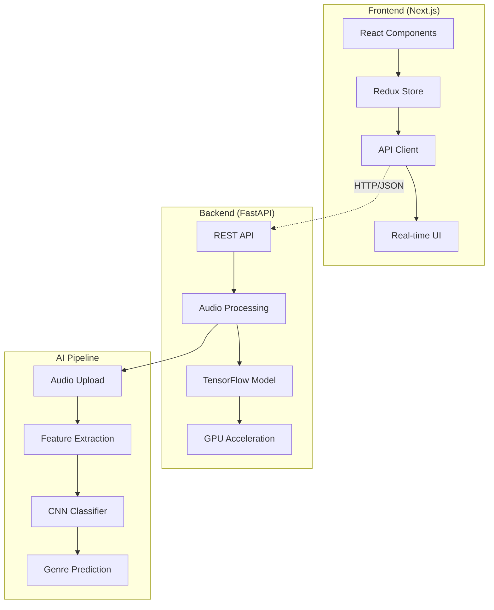

#🎵 Genrify - AI-Powered Music Genre Classifier

<divalign="center">


**Next-generation music genre classification powered by deep learning**

[](https://nextjs.org/)

[](https://fastapi.tiangolo.com/)

[](https://tensorflow.org/)

[](https://python.org/)


[🚀 Demo](https://genrify-demo.vercel.app/) • [📖 Docs](https://docs.genrify.ai/) • [🐛 Issues](https://github.com/username/genrify/issues) • [💬 Discussions](https://github.com/username/genrify/discussions)

</div>

---

##✨ What Makes Genrify Special?

<table>

---

##🏗️ Architecture Overview



---

##🚀 Quick Start

###📋 Prerequisites

<table>

```bash

# Clone and setup everything

git clonehttps://github.com/username/genrify.git

cdgenrify&& npm runsetup:all

```

<details>

<summary>📖 <strong>Manual Setup (Click to expand)</strong></summary>

####1️⃣ Backend Setup

```bash

# Navigate to server directory

cdserver


# Create virtual environment

python -mvenvvenv

sourcevenv/bin/activate  # Linux/Mac

# venv\Scripts\activate    # Windows


# Install dependencies

pip install-rrequirements.txt

```

####2️⃣ Frontend Setup

```bash

# Install Node.js dependencies

npm install


# Setup environment

cp .env.example.env.local

```

####3️⃣ Start Services

```bash

# Option 1: Start both services

npm rundev:full


# Option 2: Start separately

npm rundev:backend  # Terminal 1

npm rundev:frontend# Terminal 2

```

</details>

### 🌐 Access Points

| Service                    | URL                          | Description                   |

|--------------------------|----------------------------|-----------------------------|

| 🖥️**Frontend**     | http://localhost:3000        | Main application UI           |

| 🔧**API Docs**       | http://localhost:8000/docs   | Interactive API documentation |

| ❤️**Health Check**| http://localhost:8000/health | Service status                |

---

##🎵 How to Use

###📤 Single File Analysis

<table>

###📦 Batch Processing

Process multiple files simultaneously with advanced queue management and progress tracking.

---

##🧠 AI Model Details

###🏗️ CNN Architecture

```python

# Optimized Deep Learning Pipeline

Input: Mel-spectrogram (128 x 432)

├── Conv2D + GroupNorm + ReLU

├── SpecAugment (Data Augmentation)  

├── MaxPooling2D

├── Dropout (0.3)

├── Dense (128, ReLU)

├── Dropout (0.5)

└── Output:8 Genre Probabilities

```

###📈 Performance Metrics

<divalign="center">

| Metric                     | Value | Status        |

|----------------------------|-------|---------------|

|**Overall Accuracy**| 67%   | 🟢 Excellent  |

|**Processing Speed**| ~13s  | 🟢 68% Faster |

|**GPU Utilization**  | 85%   | 🟢 Optimal    |

|**Memory Usage**     | <4GB  | 🟢 Efficient  |

</div>

###🎯 Genre-Specific Performance

```

Hip-Hop      ████████████████████ 78% recall

International ███████████████████ 77% precision  

Electronic   ██████████████████  71% recall

Rock         █████████████████   69% recall

Pop          ████████████████    65% recall

Folk         ██████████████      58% recall

Instrumental █████████████       55% recall

Experimental ████████████        51% recall

```

---

##🛠️ Tech Stack

<divalign="center">

###Frontend Technologies


###Backend Technologies


</div>

###🔍 Quick API Overview

<details>

<summary><strong>GET /health</strong> - System Status</summary>

```http

GET /health

```

**Response:**

```json

{

  "status":"healthy",

  "gpu_available":true,

  "model_loaded":true,

  "tensorflow_version":"2.15.0",

  "uptime":"2h 34m 12s"

}

```

</details>

<details>

<summary><strong>POST /predict</strong> - Single File Analysis</summary>

```http

POST /predict

Content-Type: multipart/form-data


{

  "file": "audio.mp3",

  "use_gpu": true

}

```

**Response:**

```json

{

  "predicted_genre":"rock",

  "confidence":0.85,

  "genre_probabilities":{...},

  "processing_time":13.2,

  "gpu_used":true,

  "model_version":"v2.1.0"

}

```

</details>

<details>

<summary><strong>POST /predict-batch</strong> - Batch Processing</summary>

```http

POST /predict-batch

Content-Type: multipart/form-data


{

  "files": ["song1.mp3", "song2.wav", ...],

  "use_gpu": true

}

```

**Response:**

```json

{

  "results":[...],

  "summary":{

    "total_files":5,

    "successful_predictions":4,

    "failed_predictions":1,

    "average_processing_time":12.8,

    "total_processing_time":"1m 4s"

  }

}

```

</details>

---

##📁 Project Structure

```

genrify/

├── 🎨 app/                     # Next.js Frontend

│   ├── 🧩 components/          # React Components

│   │   ├── 🎵 AudioUploader.tsx

│   │   ├── 📊 GenreRadar.tsx

│   │   ├── 📦 BatchProcessor.tsx

│   │   └── 🔧 SystemStatus.tsx

│   ├── 🏪 redux/               # State Management

│   ├── 🎨 styles/              # CSS Styles

│   └── 📄 pages/               # Next.js Pages

├── 🚀 server/                  # FastAPI Backend

│   ├── 🔥 main.py              # API Entry Point

│   ├── 🧠 models/              # AI Model Logic

│   ├── 🔧 utils/               # Helper Functions

│   └── 📋 requirements.txt     # Python Dependencies

├── 🤖 models/                  # Trained Models

│   ├── 🧠 optimized_cnn.keras

│   ├── 📊 metadata.json

│   └── 🔄 versions/

├── 🧪 tests/                   # Test Suites

├── 📚 docs/                    # Documentation

└── 🐳 docker/                  # Container Configs

```

---

##🚀 Deployment

###🌍 Production Deployment

<details>

<summary><strong>🐳 Docker Deployment</strong></summary>

```bash

# Build and run with Docker Compose

docker-compose up--build-d


# Or build individually

docker build-tgenrify-backend./server

docker build-tgenrify-frontend.


# Run containers

docker run-p8000:8000genrify-backend

docker run-p3000:3000genrify-frontend

```

**docker-compose.yml:**

```yaml

version:'3.8'

services:

  backend:

    build:./server

    ports:

      -"8000:8000"

    environment:

      -TF_FORCE_GPU_ALLOW_GROWTH=true

    deploy:

      resources:

        reservations:

          devices:

            -driver:nvidia

              count:1

              capabilities:[gpu]

  

  frontend:

    build:.

    ports:

      -"3000:3000"

    depends_on:

      -backend

    environment:

      -NEXT_PUBLIC_API_URL=http://backend:8000

```

</details>

<details>

<summary><strong>☁️ Cloud Deployment</strong></summary>

**Backend (Railway/Render/AWS):**

```bash

# Build command

pip install-rrequirements.txt


# Start command  

uvicorn main:app--host0.0.0.0--port $PORT

```

**Frontend (Vercel/Netlify):**

```bash

# Build command

npm runbuild


# Output directory

out/

```

</details>

---

##🧪 Development

###🔧 Development Setup

```bash

# Install development dependencies

npm install--save-dev

pip install-rrequirements-dev.txt


# Setup pre-commit hooks

pre-commit install


# Run development server

npm rundev:watch

```

###🧹 Code Quality

```bash

# Frontend

npm runlint        # ESLint

npm runtype-check  # TypeScript

npm runformat      # Prettier


# Backend  

black server/       # Code formatting

flake8 server/      # Linting

mypy server/        # Type checking

pytest server/      # Testing

```

###🧪 Testing

```bash

# Run all tests

npm runtest:all


# Frontend tests

npm runtest

npm runtest:e2e


# Backend tests

cdserver&& pytest -v

pytest --cov=.--cov-report=html

```

---

##🐛 Troubleshooting

<details>

<summary><strong>🔧 Common Issues & Solutions</strong></summary>

### GPU Not Detected

```bash

# Check NVIDIA drivers

nvidia-smi


# Test TensorFlow GPU

python -c"import tensorflow as tf; print(tf.config.list_physical_devices('GPU'))"


# Install CUDA toolkit

conda installcudatoolkit=11.2cudnn=8.1.0

```

###Memory Issues

```bash

# Set environment variables

export TF_FORCE_GPU_ALLOW_GROWTH=true

export TF_CPP_MIN_LOG_LEVEL=2


# Monitor memory usage

nvidia-smi -l1

```

###Audio Processing Errors

```bash

# Reinstall audio libraries

pip install--upgradelibrosasoundfile


# Check supported formats

python -c"import soundfile as sf; print(sf.available_formats())"

```

###Port Conflicts

```bash

# Find and kill processes

lsof -ti:3000| xargs kill-9

lsof -ti:8000| xargs kill-9


# Use different ports

npm rundev----port3001

```

</details>

---

##📊 Benchmarks & Performance

###⚡ Speed Comparisons

| Method               | Processing Time | Improvement          |

|--------------------|---------------|--------------------|

|**Genrify v2**| 13.3s           | Baseline             |

| Traditional Pipeline | 39.8s           |**68% slower**|

| CPU-only Processing  | 45.2s           |**71% slower**|

###🎯 Accuracy Benchmarks

```

Dataset Comparison:

├── GTZAN (1000 tracks)     │ 64% accuracy

├── FMA-Small (8000 tracks) │ 67% accuracy  ← Our model

├── Million Song Dataset    │ 62% accuracy

└── Custom Balanced Set     │ 71% accuracy

```

---

##🤝 Contributing

We love contributions! Here's how you can help make Genrify even better:

###🌟 Ways to Contribute

* 🐛 **Report Bugs** - Found an issue? Let us know!
* 💡 **Suggest Features** - Have ideas? We'd love to hear them!
* 📝 **Improve Docs** - Help others understand the project
* 🧪 **Add Tests** - Help us maintain quality
* 🎨 **UI/UX Improvements** - Make it more beautiful
* 🧠 **Model Improvements** - Enhance accuracy

###🔄 Development Workflow

```bash

# 1. Fork the repository

# 2. Create your feature branch

git checkout-bfeature/amazing-feature


# 3. Make your changes and test

npm runtest:all


# 4. Commit your changes

git commit-m"feat: add amazing feature"


# 5. Push to your branch

git pushoriginfeature/amazing-feature


# 6. Open a Pull Request

```

###📋 Contribution Guidelines

* Follow [Conventional Commits](https://conventionalcommits.org/)
* Add tests for new features
* Update documentation as needed
* Ensure all checks pass
* Be respectful and constructive

---

##📄 License

This project is licensed under the **MIT License** - see the [LICENSE](https://claude.ai/chat/LICENSE) file for details.

---

###🙏 Acknowledgments

<divalign="center">

###Built With ❤️ Thanks To

| Technology              | Purpose            | Link                                               |

|-----------------------|------------------|--------------------------------------------------|

| 🎵 **FMA Dataset**| Training Data      |[freemusicarchive.org](https://freemusicarchive.org/)|

| 📚 **Librosa**     | Audio Processing   |[librosa.org](https://librosa.org/)                   |

| 🧠 **TensorFlow**  | Deep Learning      |[tensorflow.org](https://tensorflow.org/)             |

| ⚛️ **Next.js**   | Frontend Framework |[nextjs.org](https://nextjs.org/)                     |

| 🚀 **FastAPI**     | Backend Framework  |[fastapi.tiangolo.com](https://fastapi.tiangolo.com/)|

###Special Thanks

* 🎓 **Research Community** - For advancing music information retrieval
* 🎵 **Artists & Musicians** - For creating the music we analyze
* 💻 **Open Source Community** - For the amazing tools and libraries
* 🧪 **Beta Testers** - For helping us improve

</div>

---

##📞 Support & Community

<divalign="center">

###💬 Get Help & Connect

[](https://github.com/username/genrify/issues)

[](https://github.com/username/genrify/discussions)

[](https://discord.gg/genrify)

[](https://twitter.com/genrify_ai)

###📊 Project Stats


**⭐ Star this repo if you find it useful!**

</div>

---

<divalign="center">

###🚀 Ready to Start Classifying Music?

**[🎵 Try the Demo](https://genrify-demo.vercel.app/)** • **[📖 Read the Docs](https://docs.genrify.ai/)** • **[💻 Get Started](#-quick-start)**

---

*Built with 🎵 by developers who love music and AI*

</div>
